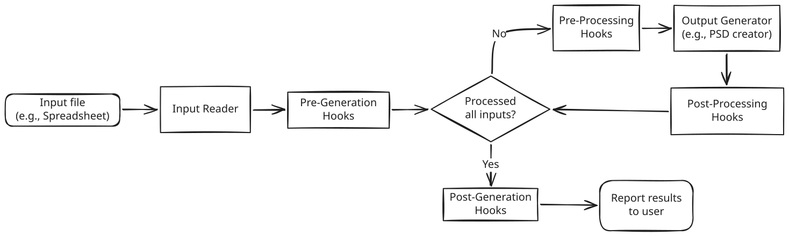

# PSAutomater

_A Photoshop Editing Automation Tool for bulk editing_.

PSAutomater is a tool that allows you to automate the process of editing images
in Photoshop. It takes an Excel spreadsheet as input, which contains the data
for each image to be edited, and generates the edited images based on a template
PSD file.

It also has other features such as...

- _Auto-Center Image_: Automatically center the subject in the image, instead of using the original position in the template.
- _Preserve Image Size_: Preserve the original size of the image, instead of resizing it to fit the template.
- _Auto-Crop Image_: Automatically crop the image to fit the template while keeping the subject in view, instead of resizing it.
- _Remove Background_: Automatically remove the background of the image, instead of keeping it as is.

**Best practices**:

- When templating images, it's best to use a template that has the same dimensions as the original images. This will ensure that the edited images look consistent.

> [!info]
> This is the next version of my "xlsx2psd" project. (its last version is `0.1.10`)

## Usage

> [!info]
> This project is still in development, and the usage instructions are not yet complete.
> Please check back later for more information.

## How It Works

1. **Input Reader**: You can choose if PSAutomater will use the Excel reader, CSV reader, JSON reader, etc.
2. **Pre-Generation Hooks**: You can enable hooks that will be used (e.g., check if image filepaths exist or manipulate text).
3. **Pre-Processing Hooks**: These hooks are the ones that modify the input data (usually the image) before being applied to the output by the output generator.
4. **Output Generator**: The output generator is chosen during the input reader selection. This is the module responsible for applying the input data to the template (e.g., the PSD file creator).
5. **Post-Processing Hooks**: These hooks do stuff to the newly-created output file. They can also update the values in the input if available (e.g., mark row as "processed" in Excel after generating PSD file in step 5).
6. **Post-Generation Hooks**: These hooks run after all rows have been processed (e.g., create a report file with a list of "failed" rows, or verify the newly-created files).
7. **Report results to user**: Shows the summary of results to the user.

## License

Resources used:

- [Adobe photoshop icons created by Fathema Khanom - Flaticon](https://www.flaticon.com/free-icons/adobe-photoshop)
- [Output icons created by inkubators - Flaticon](https://www.flaticon.com/free-icons/output)
- [Psd icons created by Good Ware - Flaticon](https://www.flaticon.com/free-icons/psd)
- [Spreadsheet icons created by Creatype - Flaticon](https://www.flaticon.com/free-icons/spreadsheet)
- [Stop button icons created by Pixel perfect - Flaticon](https://www.flaticon.com/free-icons/stop-button)
- [Video play icons created by Erifqi Zetiawan - Flaticon](https://www.flaticon.com/free-icons/video-play)
- [Xlsx icons created by Creativenoys01 - Flaticon](https://www.flaticon.com/free-icons/xlsx)
